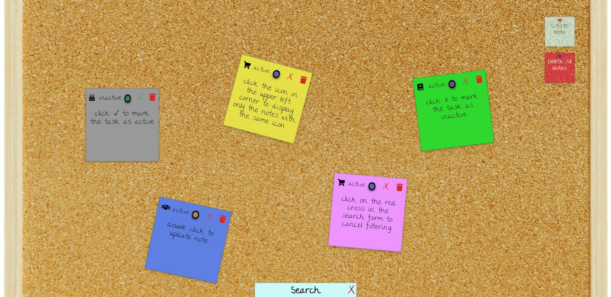

# ToDo List

## Table of Contents

- [General info](#general-info)
- [Built With](#built-with)
- [Features](#features)
- [To Do](#to-do)
- [Getting Started](#getting-started)
- [Status](#status)
- [Screenshots](#screenshots)

## General info

Todo list app built in HTML, CSS and JavaScript. It has been designed in such a way that it resembles a cork board.

## Built With

Stack:

- HTML
- CSS
- Vanilla JS ES6+
- Webpack
- Design patterns: Observer

## Features

- Drag and drop notes
- Create and delete notes
- Get, save and delete tasks from local storage

## To Do

- Update/Filter/Delete all tasks

## Getting Started

To run this project:

1. Clone or download repository:

```
git clone https://github.com/NowakArtur97/ToDo-List.git
```

2. Go to the project directory and install it using npm:

```
npm install
```

3. Run project in development mode (the application will automatically open in the browser on port 8081):

```
npm start
```

4. You can also build production version by running:

```
npm run build
```

Then go to the dist folder and open the index.html file in your browser.

## Status

Project is: in progess

## Screenshots



<p style="text-align: center">ToDo List</p>
